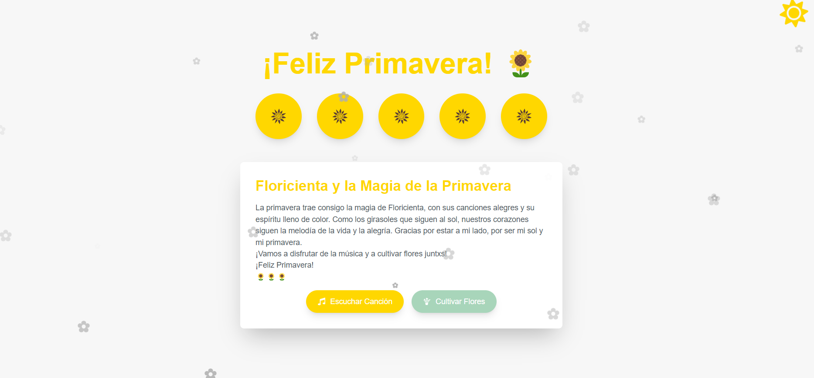
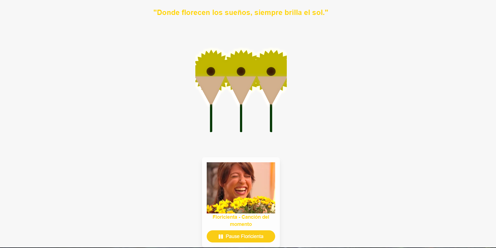

# 🌻 Virtual Garden - Girasoles Interactivos 🌻

¡Bienvenidos a **Virtual Garden**! Este es un proyecto de jardín virtual donde los usuarios pueden plantar y regar girasoles animados en un entorno 3D interactivo. Cada vez que riegas un girasol, este crece.

## 🚀 Descripción

Este proyecto utiliza tecnologías modernas como **React**, **Three.js** y **@react-three/fiber** para crear un entorno 3D interactivo donde los usuarios pueden plantar y cuidar girasoles virtuales. La experiencia es simple, intuitiva, y está llena de animaciones suaves para que los usuarios disfruten del proceso de ver crecer sus girasoles.

El proyecto está especialmente diseñado para aquellos que aman las plantas, la naturaleza, y las animaciones interactivas.

## 🎨 Características del Proyecto

- **Interfaz 3D**: Utilizamos **Three.js** y **@react-three/fiber** para renderizar un hermoso jardín interactivo.
- **Girasoles Dinámicos**: Los girasoles crecen cada vez que los riegas, y puedes plantar hasta 7.
- **Animaciones Suaves**: Cada girasol reacciona al tiempo, con rotaciones suaves y movimientos realistas.
- **Interactividad**: Haz clic en el suelo para plantar girasoles y riega cada uno para verlo crecer.

## 🛠 Tecnologías Utilizadas

- **React**: Biblioteca de JavaScript para crear interfaces de usuario.
- **Next.js**: Framework de React para una experiencia de desarrollo optimizada.
- **Three.js**: Biblioteca de JavaScript para gráficos 3D en la web.
- **@react-three/fiber**: Un adaptador de React para usar Three.js de manera declarativa.
- **@react-three/drei**: Utilidades adicionales para facilitar el uso de Three.js con React.
- **Framer Motion**: Biblioteca para crear animaciones suaves y declarativas en React.
- **TypeScript**: Lenguaje de programación tipado para evitar errores y mejorar el desarrollo.

## 📸 Capturas de Pantalla

¡Aquí puedes ver una vista previa de lo que ofrece **Virtual Garden**!

## 📝 Licencia
Este proyecto está bajo la Licencia MIT - consulta el archivo LICENSE para más detalles.

## 🌻 Agradecimientos

Gracias por visitar este jardín virtual interactivo. Espero que lo disfrutes tanto como yo disfrute creándolo. ¡Recuerda que siempre hay un girasol esperando florecer para ti! 🌞